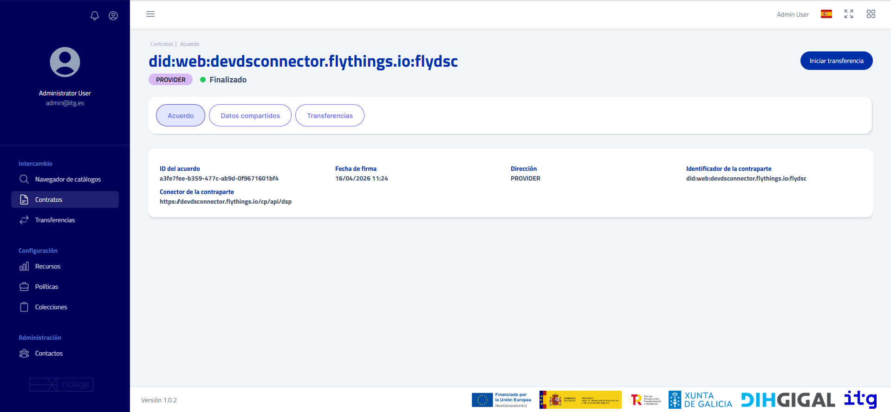

## About The Project

This is the Java SDK of the Flythings Connector Project.

## Build

```shell
mvn clean install
```

## Content

- Auth: This module includes all the authentication logic
- Connector: This module includes all the clients and services that interface with Flythings
  Connector
- Util: This module contains miscellaneous files used on the whole project like exceptions

## Installation

```xml
<dependency>
    <groupId>es.itg.flythings.dataspace</groupId>
    <artifactId>connector</artifactId>
    <version>1.0.0</version>
</dependency>
```

## Requirements

| Tool | Version |
|------|---------|
| Java | 21+     |

## Dependencies

### Runtime

| Artifact                                                                                | Version  | Description                        |
|-----------------------------------------------------------------------------------------|----------|------------------------------------|
| [`feign-jackson`](https://mvnrepository.com/artifact/io.github.openfeign/feign-jackson) | `13.9.2` | JSON serialization for HTTP client |

### Test

| Artifact                                                                              | Version  | Description            |
|---------------------------------------------------------------------------------------|----------|------------------------|
| [`junit-jupiter`](https://mvnrepository.com/artifact/org.junit.jupiter/junit-jupiter) | `5.14.3` | JUnit 5 test framework |

## Authentication

Authentication is configured on `DataspaceClient`, the central entry point for the SDK.
It supports two strategies: **static token** and **credentials-based**.

> **Note:** Static tokens may expire during long-running operations. If your use case requires
> uninterrupted access, prefer credentials-based authentication, which handles token renewal
> automatically.

### Static Token

```java
DataspaceClient client = DataspaceClient.builder()
    .apiUrl("https://sdk.api.url")
    .token("my-token")
    .build();
```

### Credentials (Recommended)

```java
DataspaceClient client = DataspaceClient.builder()
    .apiUrl("https://sdk.api.url")
    .authApiUrl("https://sdk.auth.url")
    .credentials("my-username", "my-password")
    .build();
```

When built with credentials, `DataspaceClient` automatically acquires and refreshes tokens as
needed, ensuring requests remain authenticated without manual intervention.

## Usage

`DataspaceClient` acts as a factory for both **clients** and **services**.

### Clients

Clients map closely to individual API resources. Each client exposes typed methods for a specific
domain (e.g., transfers, policies, contract negotiations).

```java
AssetClient assets = client.buildClient(AssetClient.class);
```

### Services

Services are higher-level abstractions that orchestrate multiple clients or encapsulate complex
workflows. They can be instantiated in two equivalent ways:

```java
// Via factory method (preferred)
DownloadService download = client.buildService(DownloadService.class);

// Via constructor
DownloadService download = new DownloadService(client);
```

---

### Asset Client

`buildClient(AssetClient.class)` exposes the standard CRUD operations for assets.

#### Request

**Minimal usage** — fetch all assets with default pagination:

```java
var assets = client.buildClient(AssetClient.class);

var query = new QuerySpecDTO();
query.setType("QuerySpec");

var results = assets.request(query);
```

**Filtered query** — narrow results using `CriterionDTO`:

```java
var criterion = new CriterionDTO();
criterion.setType("Criterion");
criterion.setOperandLeft("id");
criterion.setOperator("=");
criterion.setOperandRight("my-asset-id");

var query = new QuerySpecDTO();
query.setType("QuerySpec");
query.setFilterExpression(List.of(criterion));

var results = assets.request(query);
```

Returns `List<AssetOutputDTO>`.

- QuerySpecDTO

| Field              | Type                 | Default | Description                                    |
|--------------------|----------------------|---------|------------------------------------------------|
| `type`             | `String`             | —       | EDC Type — set to `QuerySpec`                  |
| `context`          | `Object`             | `null`  | JSON-LD `@context`                             |
| `offset`           | `Integer`            | `0`     | Number of results to skip                      |
| `limit`            | `Integer`            | `null`  | Maximum number of results to return            |
| `sortOrder`        | `SortEnum`           | `ASC`   | Sort direction (`ASC` or `DESC`)               |
| `sortField`        | `String`             | `null`  | Field to sort by                               |
| `filterExpression` | `List<CriterionDTO>` | `[]`    | Filter criteria (joined with AND)              |

- CriterionDTO

| Field          | Description                            |
|----------------|----------------------------------------|
| `type`         | EDC Type — set to `Criterion`          |
| `operandLeft`  | The field to filter on                 |
| `operator`     | Comparison operator                    |
| `operandRight` | Value to compare against               |

**Supported operators:**

| Operator   | Description                                               |
|------------|-----------------------------------------------------------|
| `=`        | Exact match                                               |
| `!=`       | Not equal                                                 |
| `like`     | Wildcard match — use `%` as wildcard (e.g. `my-prefix%`) |
| `in`       | Matches any value in a list                               |
| `contains` | Value is contained in the field's collection              |

- Filterable Asset Fields

| Field         | Full EDC name                                | Type     | Description                    |
|---------------|----------------------------------------------|----------|--------------------------------|
| `id`          | `https://w3id.org/edc/v0.0.1/ns/id`          | `String` | Asset identifier               |
| `name`        | `https://w3id.org/edc/v0.0.1/ns/name`        | `String` | Human-readable name            |
| `description` | `https://w3id.org/edc/v0.0.1/ns/description` | `String` | Asset description              |
| `contenttype` | `https://w3id.org/edc/v0.0.1/ns/contenttype` | `String` | MIME type of the asset content |
| `createdAt`   | `https://w3id.org/edc/v0.0.1/ns/createdAt`   | `long`   | Creation timestamp (epoch ms)  |

#### Get by ID

```java
var asset = assets.getById("my-asset-id");
```

Returns an `AssetOutputDTO`.

#### Create

```java
var dataAddress = new DataAddressDTO();
dataAddress.setAddressType("HttpData");
dataAddress.setBaseUrl("https://jsonplaceholder.typicode.com/todos");

var asset = new AssetInputDTO();
asset.setProperties(Map.of(
    "title", "Test TODO",
    "description", "Simple ToDo JSON sample",
    "contentType", "application/json"
));
asset.setDataAddress(dataAddress);

var result = assets.create(asset);
```

Returns `IdResponseDTO` containing the created asset's `id`.

- AssetInputDTO

| Field               | Type             | Required | Description                                      |
|---------------------|------------------|----------|--------------------------------------------------|
| `id`                | `String`         |          | Explicit identifier — auto-generated if omitted  |
| `properties`        | `Map<String, Object>` | ✓   | Public asset metadata                            |
| `privateProperties` | `Map<String, Object>` |     | Metadata visible only to the asset owner         |
| `dataAddress`       | `DataAddressDTO` | ✓        | Describes where and how the asset data is accessed |

- DataAddressDTO

| Field               | Type      | Required           | Description                                                 |
|---------------------|-----------|--------------------|-------------------------------------------------------------|
| `addressType`       | `String`  | ✓                  | Transport type — e.g. `HttpData`, `AmazonS3`, `AzureBlob`  |
| `baseUrl`           | `String`  | ✓ (for `HttpData`) | Base URL of the data source                                 |
| `proxyPath`         | `Boolean` |                    | Whether to proxy path segments                              |
| `proxyQueryParams`  | `Boolean` |                    | Whether to proxy query parameters                           |

- Asset Properties

| Property            | Type      | Description                                                         |
|---------------------|-----------|---------------------------------------------------------------------|
| `title`             | `String`  | Human-readable display name                                         |
| `description`       | `String`  | Full description of the asset content                               |
| `keywords`          | `List`    | Tags for discovery and filtering                                    |
| `offerType`         | `String`  | Offering classification (e.g. `Available`, `OnRequest`)             |
| `publicTitle`       | `String`  | Title shown in the marketplace                                      |
| `publicDescription` | `String`  | Description shown in the marketplace                                |
| `theme`             | `String`  | Thematic category                                                   |
| `optOut`            | `Boolean` | When true, the asset will not be publicly listed in the marketplace |

#### Update

Replace an asset's metadata and data address. Target asset is identified by `id`:

```java
asset.setId("my-asset-id");
assets.update(asset);
```

Returns `void`. For field descriptions see [Create](#create).

#### Delete

```java
assets.delete("my-asset-id");
```

Returns `void`.

---

### Policy Client

`buildClient(PolicyClient.class)` exposes CRUD operations for policy definitions, plus evaluation
and validation.

#### Request

```java
var policies = client.buildClient(PolicyClient.class);

var query = new QuerySpecDTO();
query.setType("QuerySpec");

var results = policies.request(query);
```

Returns `List<PolicyDefinitionOutputDTO>`.

#### Get by ID

```java
var policy = policies.getById("my-policy-id");
```

Returns a `PolicyDefinitionOutputDTO`.

#### Create

```java
var policy = new PolicyDefinitionInputDTO();
policy.setId("my-policy-id");
policy.setPolicy(Map.of(
    "@type", "Set",
    "permission", List.of(Map.of(
        "action", "use",
        "constraint", Map.of(
            "leftOperand", "MembershipCredential",
            "operator", "eq",
            "rightOperand", "active"
        )
    ))
));

var result = policies.create(policy);
```

Returns `IdResponseDTO` containing the created policy's `id`.

- PolicyDefinitionInputDTO

| Field               | Type                  | Required | Description                                                    |
|---------------------|-----------------------|----------|----------------------------------------------------------------|
| `id`                | `String`              |          | Explicit identifier — auto-generated if omitted                |
| `policy`            | `Map<String, Object>` | ✓        | ODRL policy expression — see *Policy Structure* below          |
| `privateProperties` | `Map<String, Object>` |          | Private metadata attached to the policy, not shared externally |

- Policy Structure

The `policy` map follows the [ODRL Information Model](https://www.w3.org/TR/odrl-model/). The
top-level `@type` is typically `Set`, with one or more rule arrays:

| Key           | Description                                                            |
|---------------|------------------------------------------------------------------------|
| `permission`  | Actions that are explicitly allowed, optionally subject to constraints |
| `prohibition` | Actions that are explicitly forbidden                                  |
| `obligation`  | Actions that must be performed as a condition of use                   |

Each constraint contains:

| Field          | Description                                                 |
|----------------|-------------------------------------------------------------|
| `leftOperand`  | The attribute being evaluated — e.g. `MembershipCredential` |
| `operator`     | Comparison operator — e.g. `eq`, `neq`, `gt`, `lt`, `in`   |
| `rightOperand` | The value to compare against                                |

#### Update

```java
policies.edit(policy);
```

Returns `void`. For field descriptions see [Create](#create-1).

#### Delete

```java
policies.delete("my-policy-id");
```

Returns `void`.

#### Evaluate

Generate an evaluation plan describing the steps the connector would execute when enforcing a policy:

```java
var request = new PolicyEvaluationPlanRequestDTO();
request.setPolicyScope("catalog");

var plan = policies.evaluate("my-policy-id", request);
```

Returns a `PolicyEvaluationPlanDTO`.

- PolicyEvaluationPlanRequestDTO

| Field         | Description                                                                         |
|---------------|-------------------------------------------------------------------------------------|
| `policyScope` | Scope within which the policy is evaluated — e.g. `catalog`, `contract.negotiation` |

#### Validate

Check whether a policy is structurally and semantically valid:

```java
var result = policies.validate("my-policy-id");
```

Returns `PolicyValidationResultDTO`.

| Field     | Type           | Description                                                     |
|-----------|----------------|-----------------------------------------------------------------|
| `valid`   | `Boolean`      | `true` if the policy passed all validation checks               |
| `errors`  | `List<String>` | Human-readable error messages — empty when valid                |

---

### Contract Definitions Client

`buildClient(ContractDefinitionClient.class)` exposes CRUD operations for contract definitions plus
lifecycle state management.

A contract definition links an access policy, a contract policy, and an asset selector together —
it is what makes assets visible and negotiable in the catalog.

#### Request

```java
var contracts = client.buildClient(ContractDefinitionClient.class);

var query = new QuerySpecDTO();
query.setType("QuerySpec");

var results = contracts.request(query);
```

Returns `List<ContractDefinitionOutputDTO>`.

- Filterable Contract Fields

| Field              | Type     | Description                                     |
|--------------------|----------|-------------------------------------------------|
| `id`               | `String` | Contract definition identifier                  |
| `accessPolicyId`   | `String` | Identifier of the access policy                 |
| `contractPolicyId` | `String` | Identifier of the contract policy               |
| `createdAt`        | `long`   | Creation timestamp (epoch ms)                   |
| `state`            | `String` | Current lifecycle state — see `ContractState`   |

#### Get by ID

```java
var contract = contracts.getById("my-contract-id");
```

Returns a `ContractDefinitionOutputDTO`.

#### Create

```java
var selector = new CriterionDTO();
selector.setType("Criterion");
selector.setOperandLeft("id");
selector.setOperator("=");
selector.setOperandRight("my-asset-id");

var contract = new ContractDefinitionInputDTO();
contract.setId("my-contract-id");
contract.setAccessPolicyId("my-access-policy-id");
contract.setContractPolicyId("my-contract-policy-id");
contract.setAssetsSelector(List.of(selector));

var result = contracts.create(contract);
```

Returns `IdResponseDTO` containing the created contract's `id`.

- ContractDefinitionInputDTO

| Field               | Type                 | Required | Description                                                                                                                          |
|---------------------|----------------------|----------|--------------------------------------------------------------------------------------------------------------------------------------|
| `id`                | `String`             |          | Explicit identifier — auto-generated if omitted                                                                                      |
| `accessPolicyId`    | `String`             | ✓        | Policy governing who may see this contract in the catalog                                                                            |
| `contractPolicyId`  | `String`             | ✓        | Policy governing the terms under which data may be transferred                                                                       |
| `assetsSelector`    | `List<CriterionDTO>` | ✓        | Criteria selecting which assets this contract applies to — follows the same `CriterionDTO` structure as `QuerySpecDTO.filterExpression` |
| `privateProperties` | `Map<String, Object>` |         | Private metadata, not shared externally                                                                                              |

#### Update

```java
contracts.update(contract);
```

Returns `void`. For field descriptions see [Create](#create-2).

#### Change State

Advance or rewind a contract definition through its lifecycle:

```java
contracts.changeState("my-contract-id", ContractState.PUBLISHED);
```

Returns `void`.

- ContractState

States are ordered and traversable in both directions:

```
PREPARING ⇄ UNDER_REVIEW ⇄ READY ⇄ PUBLISHED
```

| State          | Description                                                               |
|----------------|---------------------------------------------------------------------------|
| `PREPARING`    | Being configured — not yet active                                         |
| `UNDER_REVIEW` | Undergoing review before publication                                      |
| `READY`        | Validated and ready to be published (does not exist yet on the EDC catalog) |
| `PUBLISHED`    | Active and visible in the provider's catalog                              |

#### Delete

```java
contracts.delete("my-contract-id");
```

Returns `void`.

---

### Contract Negotiations Client

`buildClient(ContractNegotiationClient.class)` manages the lifecycle of contract negotiations — the
protocol-level handshake between consumer and provider that produces a contract agreement.

#### Request

```java
var negotiations = client.buildClient(ContractNegotiationClient.class);

var query = new QuerySpecDTO();
query.setType("QuerySpec");

var results = negotiations.request(query);
```

Returns `List<ContractNegotiationDTO>`.

- Filterable Negotiation Fields

| Field                 | Type     | Description                                                       |
|-----------------------|----------|-------------------------------------------------------------------|
| `id`                  | `String` | Negotiation identifier                                            |
| `state`               | `String` | Current lifecycle state — e.g. `REQUESTED`, `AGREED`, `FINALIZED` |
| `assetId`             | `String` | Identifier of the targeted asset                                  |
| `contractAgreementId` | `String` | Resulting agreement identifier (populated once `AGREED`)          |
| `counterPartyId`      | `String` | Participant identifier of the counterparty                        |
| `counterPartyAddress` | `String` | DSP endpoint URL of the counterparty                              |
| `createdAt`           | `long`   | Creation timestamp (epoch ms)                                     |

#### Get by ID

```java
var negotiation = negotiations.getById("my-negotiation-id");
```

Returns a `ContractNegotiationDTO`.

#### Get State

Returns a lightweight `NegotiationStateDTO` containing only the current `state` string — useful for
polling without fetching the full negotiation:

```java
var state = negotiations.getStateById("my-negotiation-id");
```

Returns a `NegotiationStateDTO`.

#### Get Agreement

Get the agreement derived from a contract negotiation:

```java
var agreement = negotiations.getAgreement("my-negotiation-id");
```

Returns `ContractAgreementDTO` once the negotiation has reached `AGREED` state.

#### Create

Initiate a new contract negotiation with a provider:

```java
var offer = new OfferDTO();
offer.setId("offer-id:contract-def-1:provider-connector-id");
offer.setAssigner("provider-participant-id");
offer.setTarget("my-asset-id");

var request = new ContractRequestDTO();
request.setCounterPartyAddress("https://provider.connector/protocol");
request.setProtocol("dataspace-protocol-http");
request.setPolicy(offer);

var result = negotiations.create(request);
```

Returns `IdResponseDTO` containing the created negotiation's `id`.

- ContractRequestDTO

| Field                 | Type                       | Required | Description                                              |
|-----------------------|----------------------------|----------|----------------------------------------------------------|
| `counterPartyAddress` | `String`                   | ✓        | DSP protocol endpoint URL of the provider connector      |
| `protocol`            | `String`                   | ✓        | Dataspace protocol — typically `dataspace-protocol-http` |
| `policy`              | `OfferDTO`                 | ✓        | ODRL offer to propose to the provider                    |
| `callbackAddresses`   | `List<CallbackAddressDTO>` |          | Endpoints to notify on negotiation state changes         |
| `privateProperties`   | `Map<String, Object>`      |          | Private metadata, not shared externally                  |

- OfferDTO

| Field        | Type                          | Required | Description                                                        |
|--------------|-------------------------------|----------|--------------------------------------------------------------------|
| `id`         | `String`                      | ✓        | Offer identifier — typically matches the catalog policy identifier |
| `assigner`   | `String`                      | ✓        | Participant identifier of the provider                             |
| `target`     | `String`                      | ✓        | Identifier of the asset this offer applies to                      |
| `permission` | `List<Map<String, Object>>`   |          | ODRL permission rules granted by this offer                        |
| `prohibition`| `List<Map<String, Object>>`   |          | ODRL prohibition rules imposed by this offer                       |
| `obligation` | `List<Map<String, Object>>`   |          | ODRL obligation rules required by this offer                       |

#### Terminate

```java
negotiations.terminate("my-negotiation-id");
```

Returns `void`.

#### Hide

Exclude a negotiation from query results without deleting it:

```java
negotiations.hide("my-negotiation-id");
```

Returns `void`.

#### Delete

```java
negotiations.delete("my-negotiation-id");
```

Returns `void`.

---

### Contract Agreements Client

`buildClient(ContractAgreementClient.class)` provides read access to contract agreements — the
binding result of a successfully completed negotiation. Agreements are read-only.

#### Request

```java
var agreements = client.buildClient(ContractAgreementClient.class);

var query = new QuerySpecDTO();
query.setType("QuerySpec");

var results = agreements.request(query);
```

Returns `List<ContractAgreementDTO>`.

- Filterable Agreement Fields

| Field                 | Type     | Description                                       |
|-----------------------|----------|---------------------------------------------------|
| `id`                  | `String` | Agreement identifier                              |
| `assetId`             | `String` | Identifier of the asset covered by this agreement |
| `consumerId`          | `String` | Participant identifier of the consumer            |
| `providerId`          | `String` | Participant identifier of the provider            |
| `contractSigningDate` | `long`   | Signing timestamp (epoch ms)                      |

#### Get by ID

```java
var agreement = agreements.getById("my-agreement-id");
```

Returns `ContractAgreementDTO`.

#### Get Negotiation

Retrieve the negotiation that produced a given agreement:

```java
var negotiation = agreements.getNegotiationByAgreementId("my-agreement-id");
```

Returns `ContractNegotiationDTO`.

> **Note:** The `agreementId` returned here is also the identifier passed to `DownloadService` —
> see [DownloadService](#downloadservice).

---

### Catalog Client

`buildClient(CatalogClient.class)` provides read access to provider catalogs — the mechanism for
discovering what assets and offers are available from other connectors.

#### Get Catalog

Fetch the full catalog from a remote provider:

```java
var catalog = client.buildClient(CatalogClient.class);

var request = new CatalogRequestDTO();
request.setProtocol("dataspace-protocol-http");
request.setCounterPartyAddress("https://provider.connector/protocol");
request.setCounterPartyId("provider-participant-id");

var result = catalog.getCatalog(request);
```

Returns `CatalogDTO`.

- CatalogRequestDTO

| Field                 | Type           | Required | Description                                                         |
|-----------------------|----------------|----------|---------------------------------------------------------------------|
| `counterPartyAddress` | `String`       | ✓        | DSP protocol endpoint URL of the provider connector                 |
| `counterPartyId`      | `String`       |          | Participant identifier of the provider connector                    |
| `protocol`            | `String`       |          | Dataspace protocol — typically `dataspace-protocol-http`            |
| `querySpec`           | `QuerySpecDTO` |          | Filtering, sorting, and pagination applied to the catalog response  |
| `additionalScopes`    | `List<String>` |          | Additional credential scopes to present with the request            |

#### Get Dataset

Fetch a single dataset from a provider catalog by asset ID:

```java
var request = new DatasetRequestDTO();
request.setId("my-asset-id");
request.setProtocol("dataspace-protocol-http");
request.setCounterPartyAddress("https://provider.connector/protocol");
request.setCounterPartyId("provider-participant-id");

var dataset = catalog.getDataset(request);
```

Returns `DatasetDTO`.

- DatasetRequestDTO

| Field                 | Type           | Required | Description                                              |
|-----------------------|----------------|----------|----------------------------------------------------------|
| `id`                  | `String`       | ✓        | Identifier of the dataset (asset) to retrieve            |
| `counterPartyAddress` | `String`       | ✓        | DSP protocol endpoint URL of the provider connector      |
| `counterPartyId`      | `String`       |          | Participant identifier of the provider connector         |
| `protocol`            | `String`       |          | Dataspace protocol — typically `dataspace-protocol-http` |
| `querySpec`           | `QuerySpecDTO` |          | Filtering and pagination applied to the response         |

#### Get Contact Catalogs

Fetch catalogs from all registered contacts in a single call:

```java
var request = new ContactRequestDTO();
request.setSearch("drone");

var datasets = catalog.getContactCatalogs(request);
```

Returns `List<DetailedDatasetDTO>`.

- ContactRequestDTO

| Field    | Type   | Description                                            |
|----------|--------|--------------------------------------------------------|
| `id`     | `UUID` | Filter by a specific contact or participant identifier |
| `search` | `String` | Free-text search matched against contact properties  |

---

### Transfer Client

`buildClient(TransferClient.class)` manages the lifecycle of transfer processes — the actual
movement of data between connectors, authorized by a contract agreement.

#### Request

```java
var transfers = client.buildClient(TransferClient.class);

var query = new QuerySpecDTO();
query.setType("QuerySpec");

var results = transfers.request(query);
```

Returns `List<TransferProcessDTO>`.

- Filterable Transfer Fields

| Field            | Type     | Description                                            |
|------------------|----------|--------------------------------------------------------|
| `id`             | `String` | Transfer process identifier                            |
| `state`          | `String` | Current lifecycle state — see `TransferStateEnum`      |
| `assetId`        | `String` | Identifier of the asset being transferred              |
| `contractId`     | `String` | Identifier of the authorizing contract agreement       |
| `transferType`   | `String` | Transfer channel and direction — e.g. `HttpData-PUSH`  |
| `correlationId`  | `String` | Counterparty-side process identifier                   |
| `stateTimestamp` | `long`   | Timestamp of the last state transition (epoch ms)      |

#### Get by ID

```java
var transfer = transfers.getById("my-transfer-id");
```

Returns `TransferProcessDTO`.

#### Create

Initiate a new transfer process against a contract agreement:

```java
var destination = new DataAddressDTO();
destination.setAddressType("HttpProxy");

var transfer = new TransferRequestDTO();
transfer.setCounterPartyAddress("https://provider.connector/protocol");
transfer.setProtocol("dataspace-protocol-http");
transfer.setContractId("my-agreement-id");
transfer.setTransferType("HttpData-PULL");
transfer.setDataDestination(destination);

var result = transfers.create(transfer);
```

Returns `IdResponseDTO` containing the created transfer's `id`.

- TransferRequestDTO

| Field                 | Type                       | Required | Description                                                                                           |
|-----------------------|----------------------------|----------|-------------------------------------------------------------------------------------------------------|
| `counterPartyAddress` | `String`                   | ✓        | DSP protocol endpoint URL of the counterparty connector, usually obtained from the contract agreement |
| `contractId`          | `String`                   | ✓        | Identifier of the contract agreement authorizing this transfer                                        |
| `transferType`        | `String`                   | ✓        | Transfer channel and direction — e.g. `HttpData-PUSH`, `HttpData-PULL`                                |
| `protocol`            | `String`                   |          | Dataspace protocol — typically `dataspace-protocol-http`                                              |
| `dataDestination`     | `DataAddressDTO`           |          | Where the transferred data should be delivered                                                        |
| `callbackAddresses`   | `List<CallbackAddressDTO>` |          | Endpoints to notify on state changes                                                                  |
| `privateProperties`   | `Map<String, Object>`      |          | Private metadata, not shared externally                                                               |

#### Suspend

Temporarily pause an active transfer:

```java
var suspend = new SuspendTransferDTO();
suspend.setReason("Maintenance window");

transfers.suspend("my-transfer-id", suspend);
```

Returns `void`.

#### Resume

```java
transfers.resume("my-transfer-id");
```

Returns `void`.

#### Terminate

```java
transfers.terminate("my-transfer-id");
```

Returns `void`.

#### Deprovision

Release any resources provisioned for a completed or terminated transfer:

```java
transfers.deprovision("my-transfer-id");
```

Returns `void`.

---

### EDRs (Endpoint Data References) Client

`buildClient(EDRCacheClient.class)` manages Endpoint Data References — the short-lived access
tokens provisioned by the provider once a transfer reaches `STARTED` state. An EDR carries the
endpoint and credentials needed to actually retrieve the data.

> **Note:** In most cases you do not need to interact with this client directly. `DownloadService`
> handles EDR provisioning and data retrieval automatically. Use this client when you need
> lower-level control over the transfer lifecycle.

#### Request

```java
var edrs = client.buildClient(EDRCacheClient.class);

var query = new QuerySpecDTO();
query.setType("QuerySpec");

var results = edrs.request(query);
```

Returns `List<EndpointDataReferenceDTO>`.

- Filterable EDR Fields

| Field                   | Type     | Description                                      |
|-------------------------|----------|--------------------------------------------------|
| `id`                    | `String` | EDR identifier                                   |
| `transferProcessId`     | `String` | Identifier of the producing transfer process     |
| `agreementId`           | `String` | Identifier of the authorizing contract agreement |
| `contractNegotiationId` | `String` | Identifier of the originating negotiation        |
| `assetId`               | `String` | Identifier of the asset made accessible          |
| `providerId`            | `String` | Identifier of the provider connector             |
| `createdAt`             | `long`   | Creation timestamp (epoch ms)                    |

#### Get Address

Retrieve the resolved data endpoint address for a transfer:

```java
var address = edrs.getAddress("my-transfer-id");
```

Returns `DataAddressDTO` containing the endpoint URL and any auth headers provisioned by the
provider.

#### Download

Fetch the raw data targeted by an EDR directly:

```java
try (var response = edrs.download("my-transfer-id");
     var stream = response.body().asInputStream()) {

    byte[] content = stream.readAllBytes();
}
```

Returns a Feign `Response`. Read `response.body().asInputStream()` to get the raw bytes.

#### Delete

```java
edrs.delete("my-transfer-id");
```

Returns `void`.

---

## Services

Services are higher-level abstractions that orchestrate multiple clients or encapsulate complex
workflows. Everything that can be done with services can be done with clients — services provide
convenience for the most common use cases.

### DownloadService

`DownloadService` downloads the contents of an asset identified by a contract agreement. The
response is returned as `byte[]`.

**Minimal usage** — only `agreementId` is required:

```java
var download = client.buildService(DownloadService.class);

DownloadResult result = download.download(
    new DownloadRequest.Builder("my-agreement-id").build()
);

byte[] content = result.fileContent();
```

> **Note:** You can retrieve the `agreementId` from the web interface. Navigate to **Contracts**,
> select a contract for your desired asset, click **View Details**, and locate the **Agreement ID**
> in the Agreement section. 

**Full configuration:**

```java
DownloadRequest request = new DownloadRequest.Builder("my-agreement-id")
    .transferType("HttpData-PULL")
    .dataAddressType("HttpProxy")
    .protocol("dataspace-protocol-http")
    .context(List.of("https://w3id.org/edc/connector/management/v0.0.1"))
    .build();
```

| Parameter         | Default                   | Description                                                                   |
|-------------------|---------------------------|-------------------------------------------------------------------------------|
| `transferType`    | `HttpData-PULL`           | The transfer mechanism used to move the data                                  |
| `dataAddressType` | `HttpProxy`               | Specifies how the asset's data address is resolved                            |
| `protocol`        | `dataspace-protocol-http` | The dataspace protocol used for the transfer negotiation                      |
| `context`         | EDC management v0.0.1     | JSON-LD `@context` — override when using a custom or domain-specific ontology |

- DownloadResult

| Field         | Type     | Description                            |
|---------------|----------|----------------------------------------|
| `fileContent` | `byte[]` | Raw bytes of the downloaded asset      |
| `id`          | `String` | Identifier of the completed transfer   |

### AgreementService

`AgreementService` retrieves the contract agreements associated with a given asset.

**Minimal usage** — only `assetId` is required:

```java
var service = new AgreementService(client.buildClient(ContractAgreementClient.class));

List<ContractAgreementDTO> agreements = service.getAgreements(
    new AgreementRequest.Builder("my-asset-id").build()
);
```

**Full configuration:**

```java
AgreementRequest request = new AgreementRequest.Builder("my-asset-id")
    .context(List.of("https://w3id.org/edc/connector/management/v0.0.1"))
    .build();
```

| Parameter | Default               | Description                                                                   |
|-----------|-----------------------|-------------------------------------------------------------------------------|
| `assetId` | —                     | ✓ Identifier of the asset whose agreements to retrieve                        |
| `context` | EDC management v0.0.1 | JSON-LD `@context` — override when using a custom or domain-specific ontology |

Returns `List<ContractAgreementDTO>`.

### EdrService

`EdrService` retrieves the Endpoint Data References associated with a given contract agreement.

**Minimal usage** — only `agreementId` is required:

```java
var service = new EdrService(client.buildClient(EDRCacheClient.class));

List<EndpointDataReferenceDTO> edrs = service.getEdrs(
    new EdrRequest.Builder("my-agreement-id").build()
);
```

**Full configuration:**

```java
EdrRequest request = new EdrRequest.Builder("my-agreement-id")
    .context(List.of("https://w3id.org/edc/connector/management/v0.0.1"))
    .build();
```

| Parameter     | Default               | Description                                                                   |
|---------------|-----------------------|-------------------------------------------------------------------------------|
| `agreementId` | —                     | ✓ Identifier of the agreement whose EDRs to retrieve                          |
| `context`     | EDC management v0.0.1 | JSON-LD `@context` — override when using a custom or domain-specific ontology |

Returns `List<EndpointDataReferenceDTO>`.

### TransferService

`TransferService` initiates a transfer process for a given contract agreement.

**Minimal usage** — only `agreementId` is required:

```java
var service = new TransferService(
    client.buildClient(ContractAgreementClient.class),
    client.buildClient(TransferClient.class),
    client.buildClient(EDRCacheClient.class)
);

TransferProcessDTO transfer = service.startTransfer(
    new TransferRequest.Builder("my-agreement-id").build()
);
```

**Full configuration:**

```java
TransferRequest request = new TransferRequest.Builder("my-agreement-id")
    .transferType("HttpData-PULL")
    .dataAddressType("HttpProxy")
    .protocol("dataspace-protocol-http")
    .context(List.of("https://w3id.org/edc/connector/management/v0.0.1"))
    .build();
```

| Parameter         | Default                   | Description                                                                   |
|-------------------|---------------------------|-------------------------------------------------------------------------------|
| `agreementId`     | —                         | ✓ Identifier of the contract agreement authorizing the transfer               |
| `transferType`    | `HttpData-PULL`           | The transfer mechanism used to move the data                                  |
| `dataAddressType` | `HttpProxy`               | Specifies how the asset's data address is resolved                            |
| `protocol`        | `dataspace-protocol-http` | The dataspace protocol used for the transfer                                  |
| `context`         | EDC management v0.0.1     | JSON-LD `@context` — override when using a custom or domain-specific ontology |

Returns `TransferProcessDTO`.
